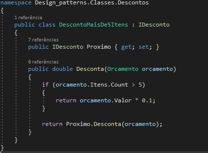

# Design patterns
 Repositorio criado para armazenar meus conhecimentos de padrao de projeto
 
 # Strategy
 

Padrao utilizado quando temos diferentes estrategias para realizar alguma acao, por exemplo, temos que calcular imposto sobre algum orcamento, temos diferentes estrategias para calcular imposto como ISS, ICMS, entre outros. Caso voce nao pense em como o seu projeto pode crescer, pode acabar criando uma classe que tem um metodo calculaImposto e que possui diversos ifs, dando para sua classe diversas funcoes e tornando o codigo muito maior, tambem um novo desenvolvedor teria que saber que quando acrescentasse um novo imposto, teria que adicionar um novo if no metodo.
 

Utilizando o padrao strategy torna-se possivel o crescimento do projeto sem nenhum problema, como fazer isso? Sabemos que ISS, ICMS, sao tipos de imposto, o padrao consiste em ter uma interface para abstrair os dados, agora voce tem uma interface com o metodo calcula e classes para cada tipo de imposto, entao teremos por exemplo a classe ISS implementando a interface Imposto.
 

Agora o metodo CalculaImposto nao precisa ter diversos if, ele apenas precisa receber como parametro um imposto, assinatura ficaria CalculaImposto(Imposto), a partir dai ele pode calcular x impostos que existirem sem ter que aumentar a complexidade do codigo da regra de negocio, pois cada tipo de imposto ira implementar a funcao calcula da sua maneira.

# Chain of responsibility

 Padrao utilizado quando temos uma cadeia de responsabilidades para realizar, por exemplo, temos que ver as condicoes de um orcamento para poder aplicar um desconto em cima dele, se sairmos apenas codificando acabaremos enchendo nosso codigo de if e else if, entao toda vez que entrasse uma nova condicao de desconto teriamos que ir no metodo CalculaDesconto e adicionar mais um else if, isso faz com que o metodo fique muito extenso.
 

Utilizando o padrao chain of responsibility torna-se possivel a adicao de um novo desconto no projeto sem nenhum problema, como fazer isso? Sabemos que existe desconto quando tem mais de 5 itens, valor maior que 500 reais ou ate mesmo nao tem desconto. Sabemos que os 3 se tratam de um tipo de desconto, entao tem comportamentos e atributos parecidos, entao implementamos uma interface. A interface IDesconto tem como atributo e metodo, IDesconto Proximo e double Desconta(Orcamento orcamento), o atributo Proximo iremos utilizar para fazer a cadeia de responsabilidades, por exemplo: Temos o desconto quando tem mais de 5 itens, caso nao entre nessa condicao, a gente retorna a funcao desconta do proximo tipo de desconto, no caso desconto quando tem valor acima de 500, ate chegar no caso escape que seria o sem desconto que tem como retorno 0, sem um proximo desconto. Esse padrao eh interessante, pois nos definimos qual eh a cadeia que iremos seguir. Isso faz com que nao tenhamos um monte de if, tornando mais elegante o codigo, distribuindo as devidas responsabilidades para cada tipo de desconto.
 

# Template Method

Padrao utilizado quando temos duas ou mais classes que implementam um metodo que tem a estrutura identica, por exemplo temos os impostos ICPP e IKCV, os dois antes de calcular o quanto de imposto deve cobrar, verficamos se deve usar maxima taxacao, verificamos de acordo com o if, caso utilizemos retornamos a maxima taxacao, caso nao devemos retornar minima taxacao.
 

Utilizando o Template Method, iremos criar a estrutura base do metodo e que eh basicamente verificar se DeveUsarMaximaTaxacao, caso deva retornar MaximaTaxacao, caso nao devemos retornar MinimaTaxacao, o que isso quer dizer? Construimos a estrutura e criamos metodos abstratos(blocos daquela estrutura) que as classes que herdarem Template Method deveram definir como sera constituido cada uma das funcoes. Vantagem em utilizar o template method eh a reducao de codigo, ja que a estrutura ficara no template e tambem deixamos paras classes apenas a responsabilidade de definir como sao feitos esses comportamentos de acordo com o necessario para elas.
 

# Decorator

Padrao utilizado quando temos a necessidade de realizar n acoes na mesma classe ou em diferentes classes para retornar um valor, por exemplo, no Brasil temos diversos tipos de impostos, logo temos que aplicar um imposto em cima do orcamento, logo apos temos que aplicar outro, em seguida outro, ate que nao haja mais impostos para aplicar. Caso nao tivessemos esse padrao, teriamos que criar x metodos ou y classes para abrangir todas as possibilidades de combinacao, imagina o quao extenso e desorganizado nosso codigo ficaria.

Utilizando o decorator iremos falar que todo imposto pode ter outroImposto, por exemplo new ISS(new ICMP()), neste caso o ISS tera o imposto ICMP, mas o ICMP nao tera outro imposto. Temos que ter agora um metodo que calcule o valor do imposto do outro imposto, entao criamos a funcao CalculaOutroImposto na classe Imposto, pois todos os impostos deveram ter esse metodo, agora podemos ver que ao chamar o metodo Calcula, o valor retornado sera o quanto deve ser aplicado + CalculaOutroImposto, isso fara que tenhamos o valor calculado de todos os impostos que estao decorados na instanciacao do imposto

# State

 
 
